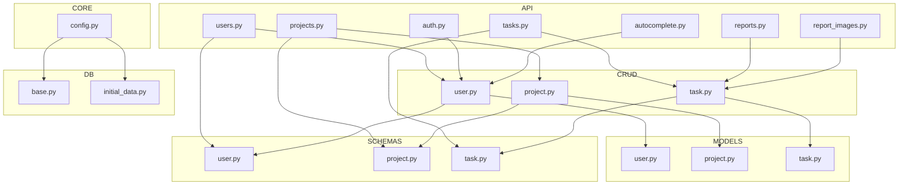

# Архитектура WorkFlow Employee

## Общая архитектура

Проект построен по принципам модульности и разделения ответственности. Используется асинхронный стек FastAPI + SQLAlchemy для высокой производительности и масштабируемости. Все бизнес-правила и доступ к данным инкапсулированы в отдельных слоях.

- **API-слой (app/api/):** маршруты FastAPI, обработка запросов, валидация входных данных, возврат сериализованных ответов.
- **CRUD-слой (app/crud/):** бизнес-логика, работа с БД через асинхронный SQLAlchemy.
- **Модели (app/models/):** ORM-описание таблиц и связей.
- **Схемы (app/schemas/):** Pydantic-схемы для сериализации/десериализации и валидации.
- **Авторизация (app/auth.py):** JWT, декораторы прав, аутентификация.
- **Конфиг (app/core/config.py):** централизованная конфигурация через .env и pydantic.
- **Инициализация БД (app/db/):** создание сессий, Alembic миграции.

## Диаграмма (упрощенная)

## Модули и их назначение

- **API-слой (app/api/):** маршруты FastAPI, обработка запросов, валидация входных данных, возврат сериализованных ответов.
- **CRUD-слой (app/crud/):** бизнес-логика, работа с БД через асинхронный SQLAlchemy.
- **Модели (app/models/):** ORM-описание таблиц и связей.
- **Схемы (app/schemas/):** Pydantic-схемы для сериализации/десериализации и валидации.
- **Авторизация (app/auth.py):** JWT, декораторы прав, аутентификация.
- **Конфиг (app/core/config.py):** централизованная конфигурация через .env и pydantic.
- **Инициализация БД (app/db/):** создание сессий, Alembic миграции.
- **alembic/** — миграции структуры БД

## Структура таблиц базы данных

### Таблица `users`
| Поле             | Тип         | Описание                        |
|------------------|-------------|---------------------------------|
| id               | UUID        | Уникальный идентификатор        |
| username         | String      | Логин пользователя              |
| hashed_password  | String      | Хэш пароля                      |
| full_name        | String      | Полное имя                      |
| role             | Enum        | Роль (admin/user)               |
| can_load_tasks   | Boolean     | Может ли загружать задачи       |
| can_view_reports | Boolean     | Может ли просматривать отчёты    |

### Таблица `projects`
| Поле             | Тип         | Описание                        |
|------------------|-------------|---------------------------------|
| id               | Integer     | Уникальный идентификатор        |
| name             | String      | Название проекта                |
| description      | String      | Описание проекта                |
| is_public        | Boolean     | Публичный ли проект             |

### Таблица `user_project_access`
| Поле         | Тип     | Описание                        |
|--------------|---------|---------------------------------|
| user_id      | UUID    | ID пользователя                 |
| project_id   | Integer | ID проекта                      |
| granted_by_id| UUID    | Кто выдал доступ                |
| granted_at   | DateTime| Когда выдан доступ              |

### Таблица `tasks`
| Поле         | Тип     | Описание                        |
|--------------|---------|---------------------------------|
| id           | Integer | Уникальный идентификатор        |
| type         | Enum    | Тип задачи                      |
| name         | String  | Название задачи                 |
| issue_url    | String  | Ссылка на задачу в трекере      |
| issue_date   | Date    | Дата постановки задачи          |
| assignee_id  | UUID    | ID исполнителя                  |
| project_id   | Integer | ID проекта                      |
| manager_id   | UUID    | ID менеджера                    |
| extra_fields | JSON    | Дополнительные поля             |

### Таблица `periods`
| Поле       | Тип     | Описание                        |
|------------|---------|---------------------------------|
| id         | Integer | Уникальный идентификатор        |
| task_id    | Integer | ID задачи                       |
| start      | Date    | Дата начала                     |
| end        | Date    | Дата окончания                  |
| type       | Enum    | Тип периода (work/test)         |
| tester_id  | UUID    | ID тестировщика                 |

### Таблица `reviews`
| Поле         | Тип     | Описание                        |
|--------------|---------|---------------------------------|
| id           | Integer | Уникальный идентификатор        |
| task_id      | Integer | ID задачи                       |
| reviewer_id  | UUID    | ID ревьюера                     |
| review_date  | Date    | Дата ревью                      |

### Таблица `task_history`
| Поле         | Тип       | Описание                        |
|--------------|-----------|---------------------------------|
| id           | Integer   | Уникальный идентификатор        |
| task_id      | Integer   | ID задачи                       |
| changed_by_id| UUID      | ID пользователя, внёсшего изменение |
| changed_at   | DateTime  | Дата и время изменения          |
| field        | String    | Изменённое поле                 |
| old_value    | String    | Старое значение                 |
| new_value    | String    | Новое значение                  |